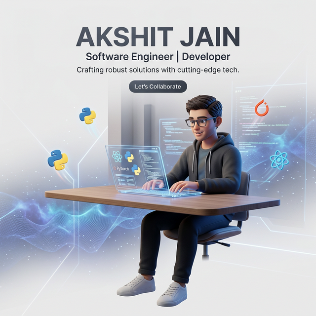

<!-- 🚀 HIGH-IMPACT HERO SECTION -->

 

# 👋 I'm Akshit Jain
### **ML Systems Engineer | Full-Stack Architect | Problem Solver**

  
  &nbsp;&nbsp;
  

---

<!-- 📊 RECRUITER DASHBOARD -->
### 01 — PERFORMANCE SNAPSHOT
<table align="center">
  <tr>
    <td align="center" width="220" style="background-color: #0d1117; border-radius: 15px; padding: 10px;">
      <b>5+</b> 
      Core Languages 
      
    </td>
    <td align="center" width="220" style="background-color: #0d1117; border-radius: 15px; padding: 10px;">
      <b>12+</b> 
      Production Projects 
      
    </td>
    <td align="center" width="220" style="background-color: #0d1117; border-radius: 15px; padding: 10px;">
      <b>100+</b> 
      Solved LeetCode 
      
    </td>
    <td align="center" width="220" style="background-color: #0d1117; border-radius: 15px; padding: 10px;">
      <b>17+</b> 
      Certifications 
      
    </td>
  </tr>
</table>

---

<!-- 🛠 TECH STACK ARSENAL -->
### 02 — THE TECH STACK
<table>
  <tr>
    <td width="33%" valign="top">
      <h4>🧠 Machine Learning</h4>
       
      Focus: Bio-Medical NLP, CV
    </td>
    <td width="33%" valign="top">
      <h4>🌐 Web Architecture</h4>
       
      Focus: Full-stack Systems
    </td>
    <td width="33%" valign="top">
      <h4>⚙️ Engineering Tools</h4>
       
      Focus: Scalable Deployment
    </td>
  </tr>
</table>

---

<!-- 🏗 PORTFOLIO SHOWCASE -->
### 03 — FEATURED WORK

<b>🤖 Clinical Entity Recognition (NLP/ML)</b>

 
Optimizing clinical data extraction using State-of-the-Art Transformers. Achieved high accuracy in identifying complex medical terms for patient stratification.
 
<code>BioBERT</code> <code>PyTorch</code> <code>HuggingFace</code>

<b>🏥 RA Patient Stratification (Data Science)</b>

 
Developed predictive models to categorize Rheumatoid Arthritis patients based on longitudinal healthcare data, enabling personalized treatment paths.
 
<code>Scikit-Learn</code> <code>Pandas</code> <code>XGBoost</code>

<b>✍️ AI-Powered Assignment Grader (CV/OCR)</b>

 
An end-to-end vision system that analyzes handwritten documents, identifies key segments, and provides automated grading feedback.
 
<code>Tesseract</code> <code>FastAPI</code> <code>OpenCV</code>

---

<!-- 📈 GITHUB ACTIVITY -->
### 04 — ECOSYSTEM & CONTRIBUTIONS

  
  

  

  

---

<!-- 📫 CONTACT & ENGAGEMENT -->
### 05 — LET'S START A CONVERSATION

  <b>Looking for a dedicated ML Engineer? I'm ready for the next challenge.</b>  
  
  &nbsp;
  

 

  <i>"Code with intent. Build with impact."</i>

  

